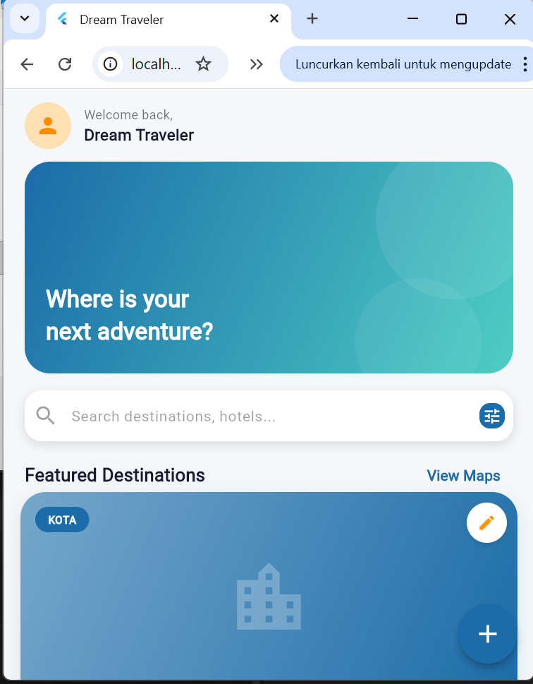
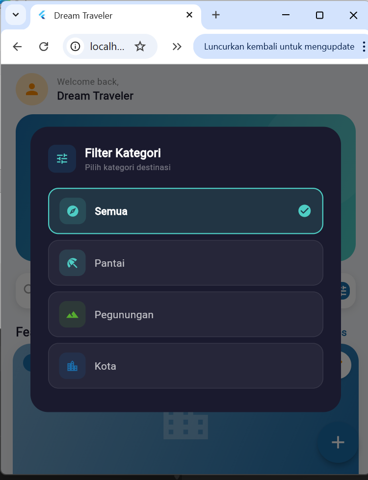
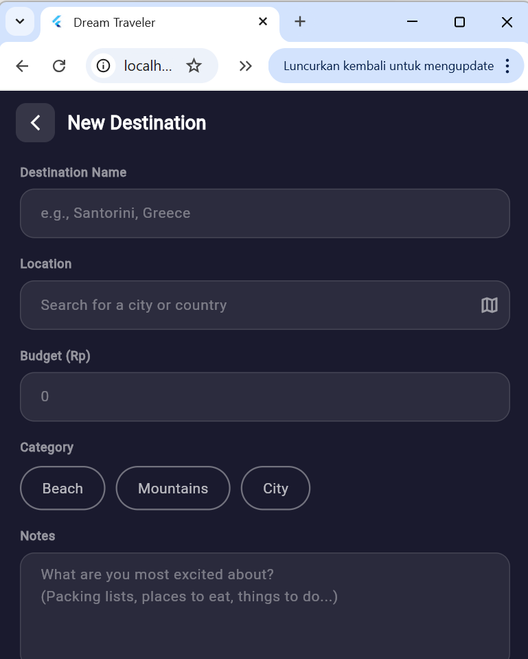
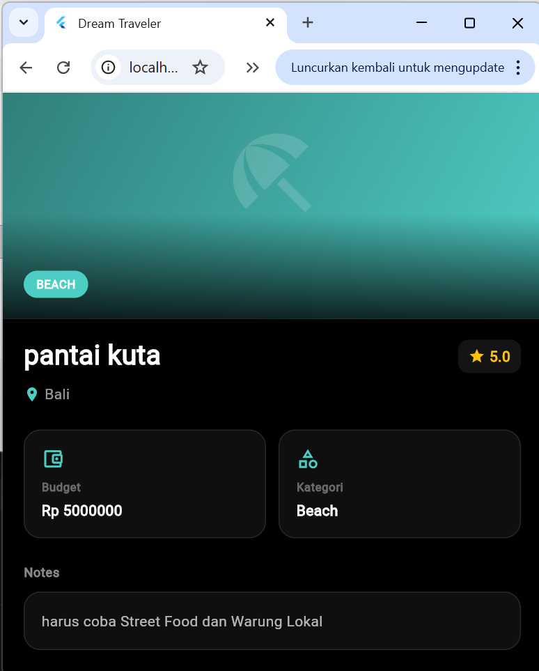
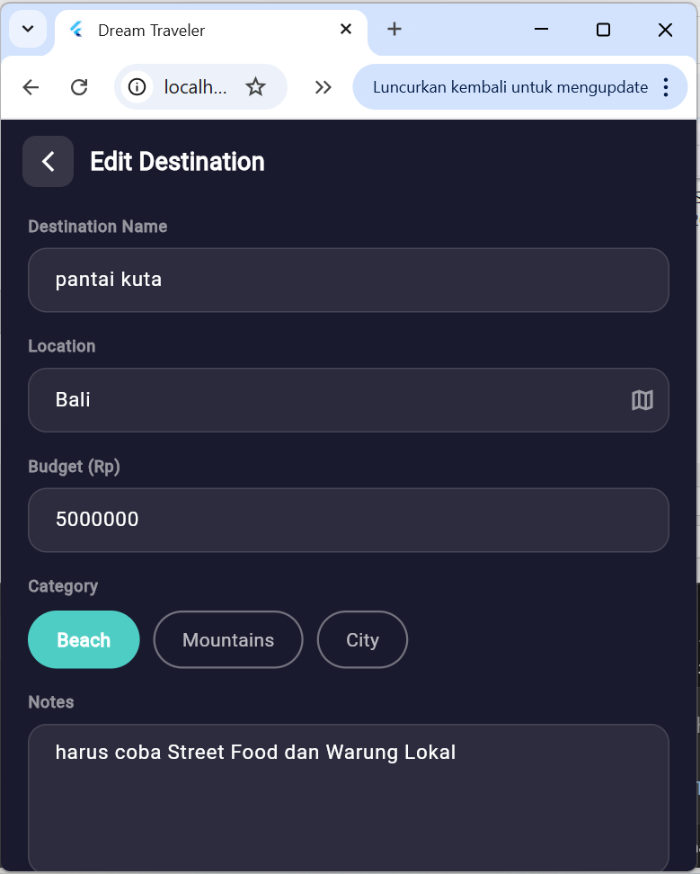
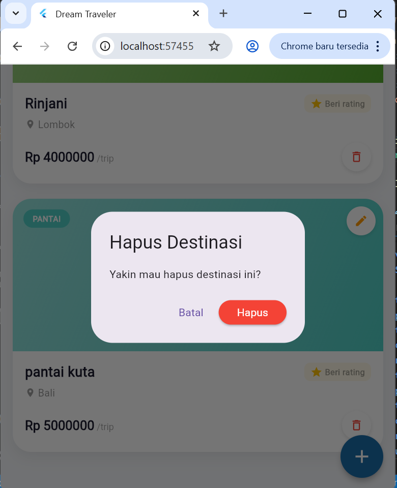
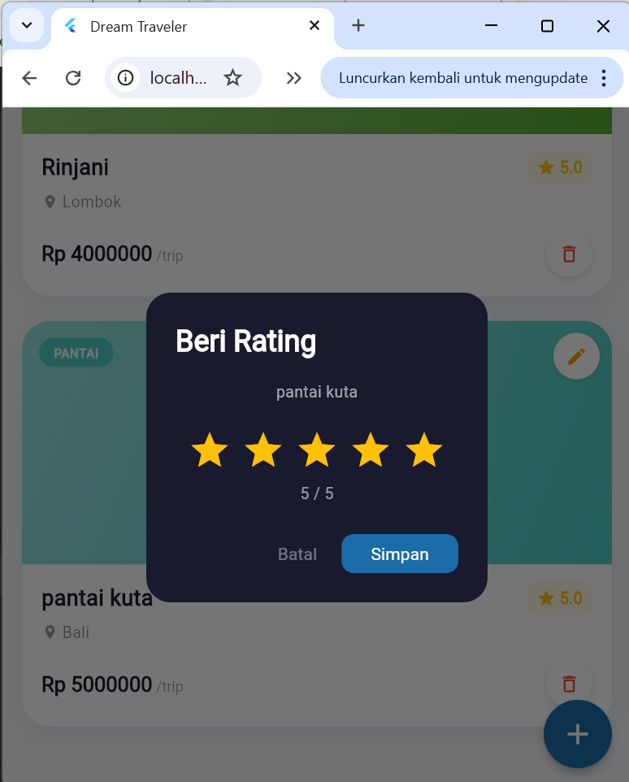

# Mini-Project2-PAB  
# Dream Traveler ✈️

| Nama                  | NIM         | Kelas             |
|-----------------------|------------|------------------|
| Vebronia Vitania Lusi | 2409116112 | Sistem Informasi C |


## Deskripsi Aplikasi

Aplikasi **Dream Traveler** adalah aplikasi berbasis **Flutter** untuk mengelola destinasi impian pengguna dengan tampilan modern dan interaktif.  
Pengguna dapat **menambahkan**, **melihat detail**, **mengedit**, **menghapus**, **memfilter**, dan **memberikan rating** pada destinasi berdasarkan pengalaman perjalanan mereka.

Setiap destinasi memiliki beberapa informasi penting, seperti:
- Nama Destinasi
- Lokasi
- Budget
- Kategori
- Catatan
- Rating

Aplikasi ini dikembangkan sebagai lanjutan dari Mini Project 1 dengan peningkatan pada **desain antarmuka**, **halaman detail**, **fitur pencarian**, **filter kategori destinasi**, dan **fitur rating destinasi**.


## Fitur Aplikasi

<details>
<summary><b>1. Halaman Utama</b></summary>
<br>

<div align="center">
 
</div>

<p align="center">
  <b><em>Halaman Utama</em></b><br>
  Menampilkan tampilan utama aplikasi dengan banner, kolom pencarian, tombol filter, serta daftar destinasi unggulan.
</p>

<div align="left">
  <b>Komponen utama:</b>
  <ul>
    <li>Header sapaan pengguna</li>
    <li>Banner perjalanan</li>
    <li>Search bar untuk mencari destinasi</li>
    <li>Tombol filter kategori</li>
    <li>Bagian <b>Featured Destinations</b></li>
    <li><b>FloatingActionButton (+)</b> untuk menambahkan destinasi</li>
  </ul>
</div>

</details>

<details>
<summary><b>2. Filter Kategori Destinasi</b></summary>
<br>

<div align="center">
  
</div>

<p align="center">
  <b><em>Filter Kategori</em></b><br>
  Pengguna dapat memfilter destinasi berdasarkan kategori yang tersedia.
</p>

<div align="left">
  <ul>
    <li><b>Semua</b> untuk menampilkan seluruh destinasi</li>
    <li><b>Pantai</b> untuk destinasi wisata pantai</li>
    <li><b>Pegunungan</b> untuk destinasi alam dan gunung</li>
    <li><b>Kota</b> untuk destinasi perkotaan</li>
  </ul>
</div>

</details>

<details>
<summary><b>3. Menambahkan Destinasi Baru</b></summary>
<br>

<div align="center">
  
</div>

<p align="center">
  <b><em>New Destination</em></b><br>
  Pengguna dapat menambahkan destinasi baru melalui form input.
</p>

<div align="left">
  <ul>
    <li>Destination Name</li>
    <li>Location</li>
    <li>Budget (Rp)</li>
    <li>Category</li>
    <li>Notes</li>
  </ul>
</div>

<p align="center">
  Data yang telah diisi akan ditampilkan ke daftar destinasi pada halaman utama.
</p>

</details>

<details>
<summary><b>4. Menampilkan Daftar Destinasi</b></summary>
<br>

<div align="center">
  
</div>

<p align="center">
  <b><em>Daftar Destinasi</em></b><br>
  Menampilkan daftar destinasi yang telah ditambahkan pengguna secara dinamis pada halaman utama.
</p>

<div align="left">
  <ul>
    <li>Nama destinasi</li>
    <li>Lokasi</li>
    <li>Budget perjalanan</li>
    <li>Kategori destinasi</li>
    <li>Rating destinasi</li>
  </ul>
</div>

</details>

<details>
<summary><b>5. Detail Destinasi</b></summary>
<br>

<div align="center">
  
</div>

<p align="center">
  <b><em>Detail Destination</em></b><br>
  Menampilkan informasi lengkap dari destinasi yang dipilih.
</p>

<div align="left">
  <ul>
    <li>Nama destinasi</li>
    <li>Lokasi</li>
    <li>Rating</li>
    <li>Budget</li>
    <li>Kategori</li>
    <li>Catatan perjalanan</li>
  </ul>
</div>

</details>

<details>
<summary><b>6. Mengedit Destinasi</b></summary>
<br>

<div align="center">
  
</div>

<p align="center">
  <b><em>Edit Destination</em></b><br>
  Pengguna dapat mengubah data destinasi yang sudah ditambahkan sebelumnya.
</p>

<div align="left">
  <ul>
    <li>Mengubah nama destinasi</li>
    <li>Mengubah lokasi</li>
    <li>Mengubah budget</li>
    <li>Mengubah kategori</li>
    <li>Mengubah catatan</li>
  </ul>
</div>

<p align="center">
  Setelah perubahan disimpan, data akan diperbarui pada tampilan aplikasi.
</p>

</details>

<details>
<summary><b>7. Menghapus Destinasi</b></summary>
<br>

<div align="center">
  
</div>

<p align="center">
  <b><em>Delete Destination</em></b><br>
  Pengguna dapat menghapus destinasi yang sudah tidak dibutuhkan lagi dari daftar perjalanan.
</p>

<div align="left">
  <ul>
    <li>Tombol hapus tersedia pada kartu destinasi</li>
    <li>Destinasi akan dihapus dari daftar</li>
    <li>Tampilan diperbarui secara langsung setelah data dihapus</li>
  </ul>
</div>

</details>
<summary><b>8. Fitur Pencarian</b></summary>
<br>

<div align="center">
  
</div>

<p align="center">
  <b><em>Search Bar</em></b><br>
  Tersedia kolom pencarian untuk membantu pengguna mencari destinasi, hotel, atau tempat yang ingin dijelajahi.
</p>

</details>

<details>
<summary><b>9. Memberikan Rating Destinasi</b></summary>
<br>

<div align="center">
  
</div>

<p align="center">
  <b><em>Rating Destinasi</em></b><br>
  Setelah selesai melakukan perjalanan, pengguna dapat memberikan rating pada destinasi yang telah dikunjungi.
</p>

<div align="left">
  <ul>
    <li>Pengguna dapat memberi nilai dari <b>1 sampai 5 bintang</b></li>
    <li>Rating membantu pengguna menilai apakah destinasi tersebut <b>bagus</b>, <b>worth it</b>, atau ingin dikunjungi lagi</li>
    <li>Hasil rating ditampilkan pada kartu destinasi dan halaman detail</li>
    <li>Fitur ini berfungsi sebagai evaluasi pribadi berdasarkan pengalaman perjalanan pengguna</li>
  </ul>
</div>

</details>

<details>
<summary><b>10. Tampilan UI Modern</b></summary>
<br>

<div align="center">
  <p align="center">
    <b><em>Modern User Interface</em></b><br>
    Aplikasi menggunakan desain antarmuka modern dengan perpaduan warna gelap dan gradasi biru-hijau, sehingga memberikan kesan elegan dan nyaman digunakan.
  </p>
</div>

</details>

---

## Teknologi yang Digunakan
- Flutter
- Dart
- StatefulWidget
- setState()
- Material Design
- Dialog / Modal

---

## Struktur Folder

```text
mini_project2_pab/
│
├─ lib/
│  ├─ main.dart
│  ├─ models/
│  │  └─ destination.dart
│  ├─ pages/
│  │  ├─ home_page.dart
│  │  ├─ add_destination_page.dart
│  │  ├─ edit_destination_page.dart
│  │  └─ detail_destination_page.dart
│  ├─ widgets/
│  │  └─ destination_card.dart
│
├─ assets/
│  ├─ images/
│  └─ screenshots/
